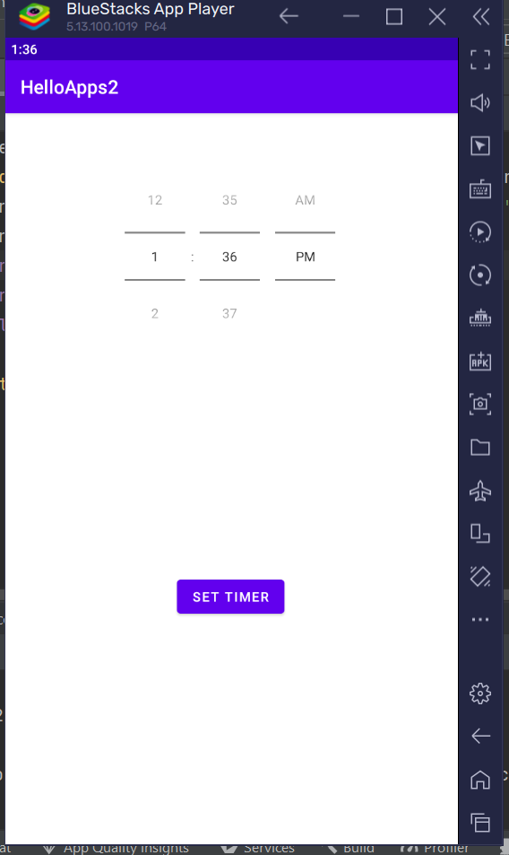

| First Header  | Second Header |
| ------------- | ------------- |
| Content Cell  | Content Cell  |

## video HelloApps2
https://github.com/Kudav5/Android-UAS/assets/96816477/e73656c2-2cce-4ee3-96be-cc83d8bd3f34

# tutorial
### 1. logo

### 2. menu

### 3. halo

### 4. Fibonacci count

### 5. sianida

### 6. alarm

### 7. two activity

### 8. maps

### 9. fragment tab1 (thumbnail)

### 10. fragment tab2 (video)

